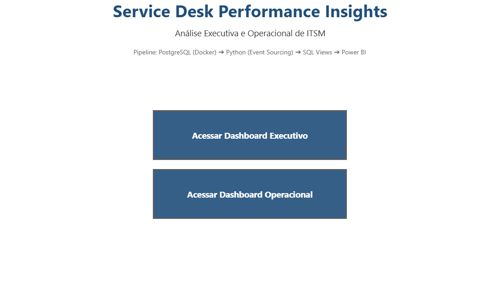
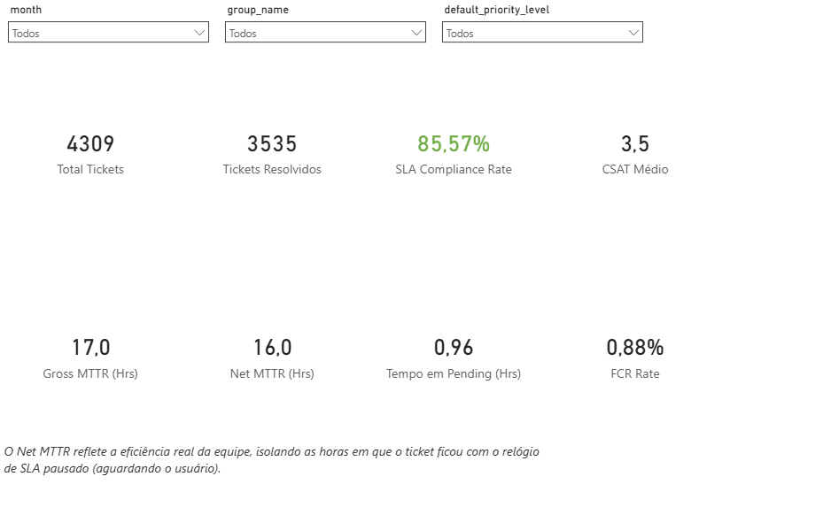
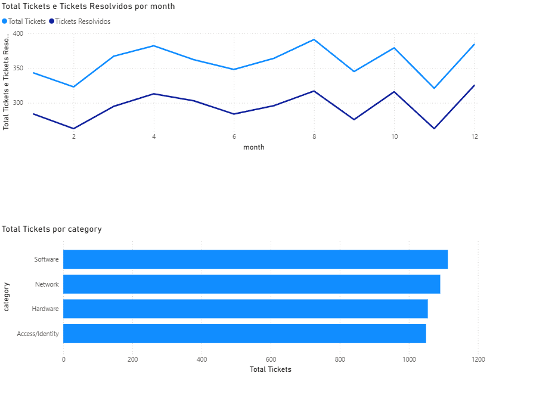
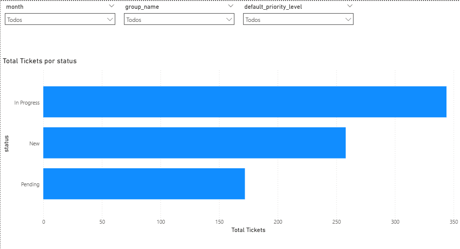
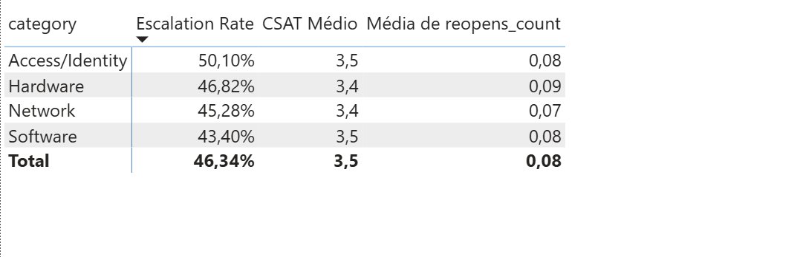
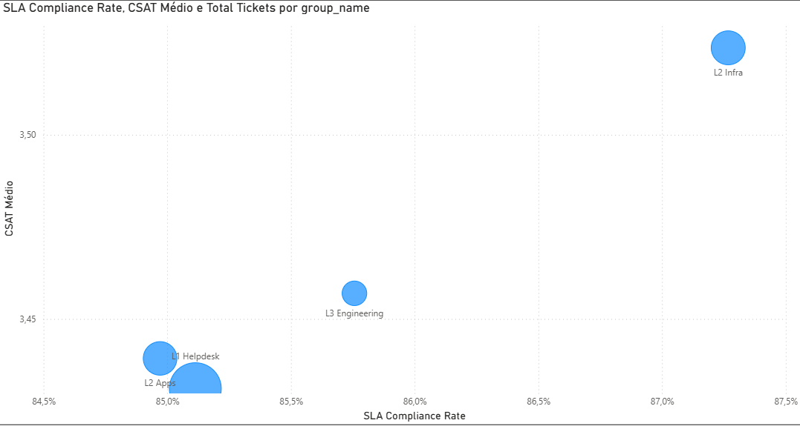
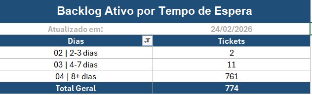
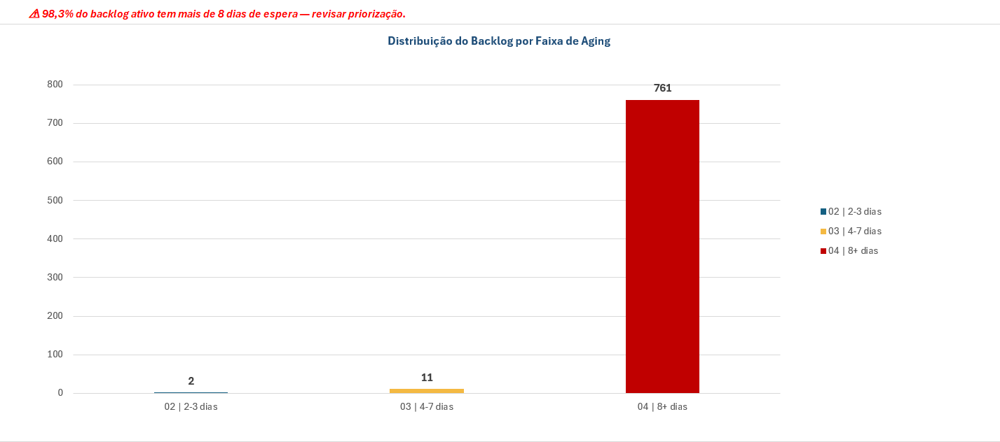
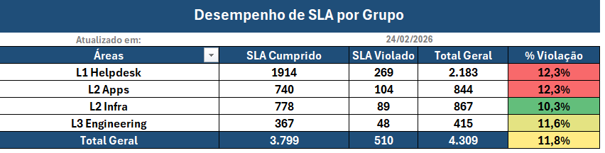
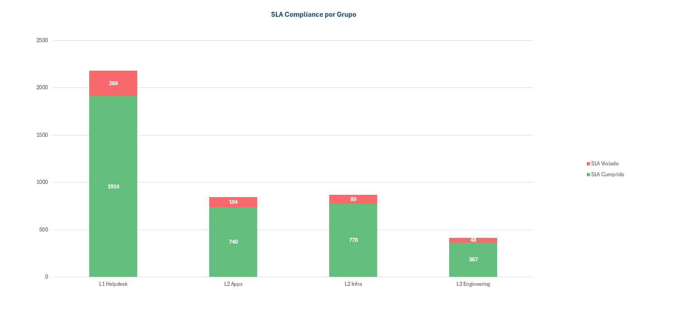

# Service Desk Performance Insights

[](#)
[](#)
[](#)
[](#)
[](#)

## Visão Executiva (O Problema de Negócio)
Este projeto é um laboratório completo de ITSM/ITIL que simula uma operação de Service Desk de ponta a ponta, incluindo níveis de atendimento L1, L2 e L3.

A proposta é transformar dados operacionais em inteligência gerencial para responder perguntas estratégicas de TI:
- Qual é a eficiência real da operação (Gross MTTR vs Net MTTR)?
- Qual é a taxa de conformidade de SLA por categoria, grupo e prioridade?
- Quanto do backlog está realmente ativo e onde está concentrado?

O ambiente simula 12 meses de operação com mais de 4.300 tickets, cobrindo ciclo de vida completo, reaberturas, pausas em Pending, escalonamentos e violação de SLA em faixa realista.

## Arquitetura de Dados
Pipeline ponta a ponta:

`Docker (PostgreSQL)` -> `Python (Faker + Pandas)` -> `Banco Relacional` -> `Views SQL de Transformação` -> `Excel (Ops Pack) / Power BI (Dashboard Executivo)`

Camadas principais:
- **Infraestrutura local:** PostgreSQL 15 via Docker Compose.
- **Geração de dados sintéticos:** Scripts Python com modelagem orientada a eventos.
- **Modelo analítico:** Star Schema (`fact_ticket`, `fact_ticket_event`, dimensões de data, categoria, grupo, SLA e localização).
- **Transformação analítica:** Views SQL para SLA Compliance, FCR/Escalonamento e Net MTTR.
- **Consumo BI:** extrações CSV para Power BI e pacote tático operacional em Excel.

## O Diferencial Técnico (Event Sourcing)
O diferencial deste projeto está na engenharia dos dados: os tickets não são registros estáticos.

Foi construída uma **Máquina de Estados (Event Sourcing)** em Python para simular a vida do chamado, evento por evento:

`New -> In Progress -> Pending -> In Progress -> Resolved -> Closed`

Com isso, a modelagem permite:
- Calcular indicadores de forma confiável a partir do histórico transacional.
- Medir **Net MTTR** com precisão, descontando o tempo em `Pending`.
- Simular reabertura de chamados sem quebrar a linha do tempo.
- Controlar a distribuição de violações de SLA em patamar realista (aprox. 10%).

Essa abordagem aproxima o laboratório de cenários reais de plataformas como ServiceNow/Jira, onde KPIs dependem de sequência de eventos e não apenas do status final.

## Galeria de Dashboards (Imagens)
### Capa do Dashboard


### Visão Executiva (Power BI)



### Visão Operacional (Power BI)




### Visão Tática (Excel Ops Pack - Aging Backlog)



### Visão Tática (Excel Ops Pack - SLA por Grupo)



## Como Reproduzir
Pré-requisitos:
- Docker Desktop ativo
- Python 3.10+ instalado

Passo a passo:
1. Clone o repositório.
```bash
git clone https://github.com/andrewDDL/service-desk-performance-insights.git
cd service-desk-performance-insights
```
2. Instale dependências Python.
```bash
python -m pip install -r requirements.txt
```
3. Suba o PostgreSQL local.
```bash
docker-compose --project-directory . -f db/docker-compose.yml up -d
```
4. Gere os dados sintéticos.
```bash
python pipelines/generate_tickets.py
```
5. Carregue os dados no PostgreSQL.
```bash
python pipelines/load_postgres.py
```
6. Materialize as views analíticas.
```bash
python scripts/run_sql_views.py
```
7. Exporte dados para consumo no BI.
```bash
python pipelines/export_for_powerbi.py
```

## Próximos Passos / Melhorias Futuras
1. Migrar o pipeline para orquestração com Apache Airflow (agendamento, observabilidade e retries).
2. Adicionar testes automatizados de qualidade de dados (Great Expectations/pytest) com gatilhos de CI.
3. Publicar o modelo em camadas Bronze/Silver/Gold e adicionar incremental load para simular operação diária.
